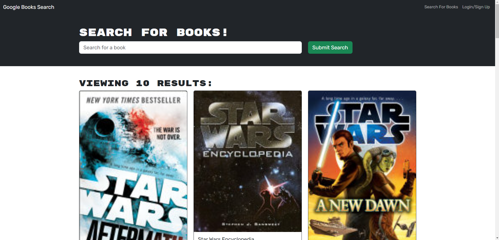

# Google Book Search

## Description:

The Google Book Search is a full stack development project that makes use of, React, Mongoose, Graphql, and Apollo. The goal of the project was to create a fully functioning front end, backend, and database configuration that allows the user to search and save books. It makes use of Google's book search api and allows the user to save the results they like to a favorites list.


## Table of Contents:
- [The Challenge](#The-Challenge)
- [Usage Information](#Usage-Information)
- [Utilized Programs](#Utilized-Programs)
- [What I Learned](#What-I-Learned)
- [Author](#Author)

## The Challenge

### Assigned User Story:
```md
AS AN avid reader
I WANT to search for new books to read
SO THAT I can keep a list of books to purchase
```

### Acceptance Criteria:
```md
GIVEN a book search engine
WHEN I load the search engine
THEN I am presented with a menu with the options Search for Books and Login/Signup and an input field to search for books and a submit button
WHEN I click on the Search for Books menu option
THEN I am presented with an input field to search for books and a submit button
WHEN I am not logged in and enter a search term in the input field and click the submit button
THEN I am presented with several search results, each featuring a book’s title, author, description, image, and a link to that book on the Google Books site
WHEN I click on the Login/Signup menu option
THEN a modal appears on the screen with a toggle between the option to log in or sign up
WHEN the toggle is set to Signup
THEN I am presented with three inputs for a username, an email address, and a password, and a signup button
WHEN the toggle is set to Login
THEN I am presented with two inputs for an email address and a password and login button
WHEN I enter a valid email address and create a password and click on the signup button
THEN my user account is created and I am logged in to the site
WHEN I enter my account’s email address and password and click on the login button
THEN I the modal closes and I am logged in to the site
WHEN I am logged in to the site
THEN the menu options change to Search for Books, an option to see my saved books, and Logout
WHEN I am logged in and enter a search term in the input field and click the submit button
THEN I am presented with several search results, each featuring a book’s title, author, description, image, and a link to that book on the Google Books site and a button to save a book to my account
WHEN I click on the Save button on a book
THEN that book’s information is saved to my account
WHEN I click on the option to see my saved books
THEN I am presented with all of the books I have saved to my account, each featuring the book’s title, author, description, image, and a link to that book on the Google Books site and a button to remove a book from my account
WHEN I click on the Remove button on a book
THEN that book is deleted from my saved books list
WHEN I click on the Logout button
THEN I am logged out of the site and presented with a menu with the options Search for Books and Login/Signup and an input field to search for books and a submit button  
```

### Screenshot:


## Usage Information

### [GitHub Repository](https://github.com/jonathanjjolsen/book-search-engine)

### Navigation
- When the user loads the [Webpage](https://dashboard.heroku.com/apps/the-best-book-search-engine) they will be greated with a nav bar in the top right and a search bar in the center of the page.
- If you would just like to search for books without saving them, just straight to the search bar and view results.
- If you would like to create a list of results you've seen in the past, you must first create an account.
- Click "Sign Up" in the top right of the page.
- After account creation, you will now be able to add books to your saved books tab.
- If you save one that you didn't mean to or don't intend to keep, you can easily remove it by clicking the remove book button located at the bottom of the book card.


## Utilized Programs
- Node.js: [20.3.0](https://nodejs.org/en)
- Mongoose: [7.0.2](https://www.npmjs.com/package/mongoose)
- Express.js: [1.0.0](https://expressjs.com/)
- MongoDB: Website [Link](https://www.mongodb.com/)
- Graphql: [15.5.0](https://graphql.org/)
- Apollo: [2.19.0](https://www.apollographql.com/docs/)

## What I Learned
- How to build a database using a NoSQL style structuring
- How to integrate graphql with react and mongoose
- How to spin up a server with a dedicated mongoDB database
- How to configure Heroku with MongoDB Atlas so they can talk to each other

## Author
Follow me on GitHub at [Jonathan Olsen](https://github.com/jonathanjjolsen)!
